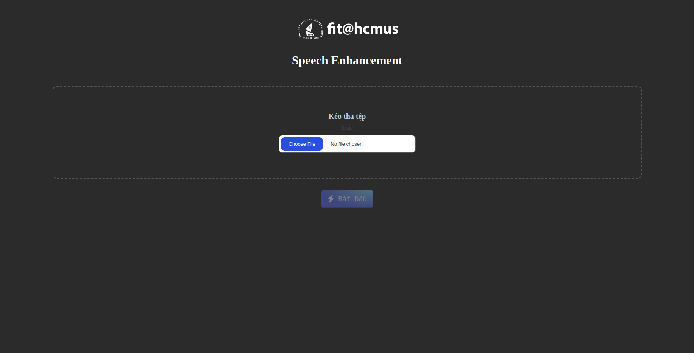
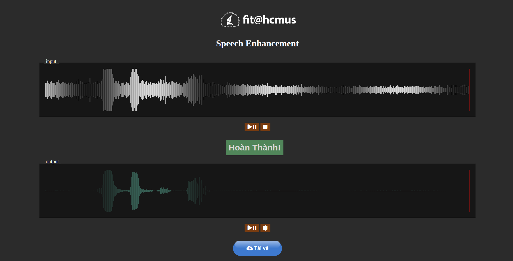
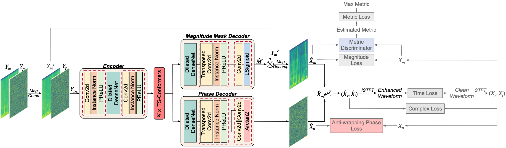
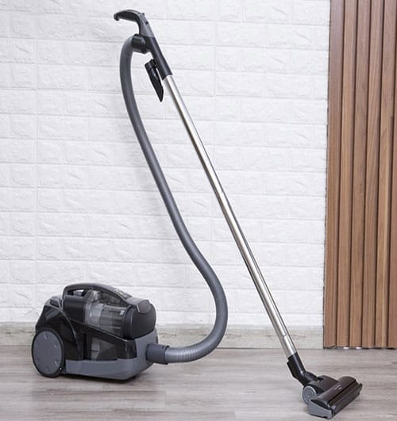
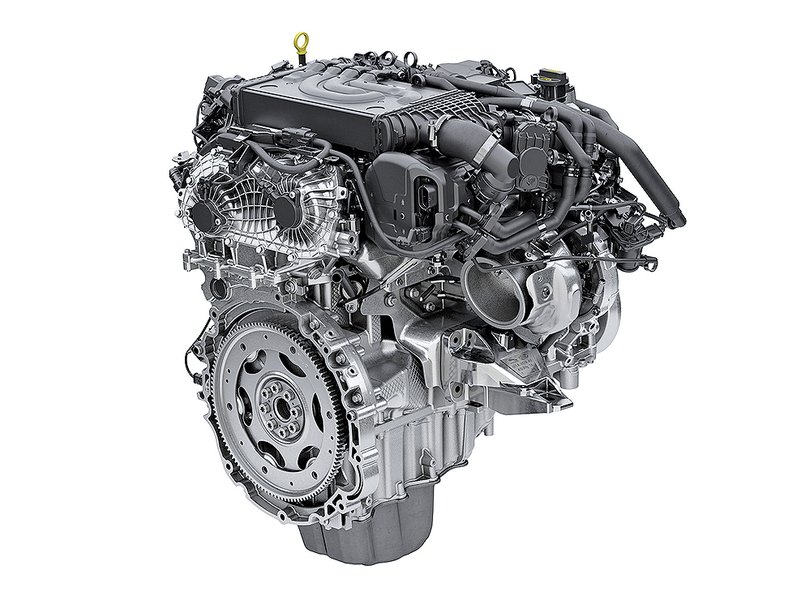
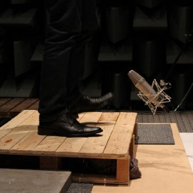
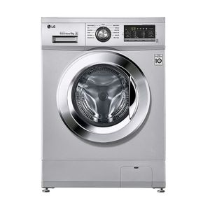
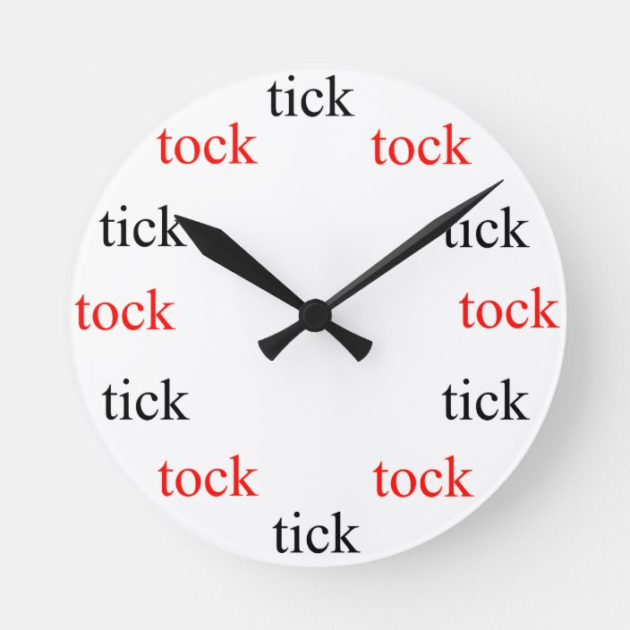

# Speech Enhancement

## Table of contents

- [Introduction](#introduction)
- [How to install](#how-to-install)
- [Demo](#demo)
- [Training](#training)
- [References](#references)
- [Contact](#contact)

## Introduction

This project is built with the purpose of eliminating noise and interference in real-world environments, making voices clearer.

## How to run

Run command

```bash
cd speech-enhancement
docker-compose up -d --build --scale app=$NUMSERVER
```

Example:
```bash
cd speech-enhancement
docker-compose up -d --build --scale app=3
```

## Demo
After the installation is complete, we will have a web interface as follows

<p align="center">
  
</p>

- Upload file and choose ``Bắt Đầu`` button, we have the result follow

<p align="center">
  
</p>

- After completion, you can listen to the audio samples before and after processing, and also download the results.

## Training

- To train the model, you can refer to the assets code available here: [MP-SENet: A Speech Enhancement Model with Parallel Denoising of Magnitude and Phase Spectra](https://github.com/yxlu-0102/MP-SENet)

<p align="center">
  
</p>

### Data preparation

The project utilizes two main datasets:
- [VoiceBank+DEMAND](https://paperswithcode.com/dataset/voice-bank-demand)
- Synthesis data

With synthsis data:
- Clean Audio: We leverage clean audio data from the [FPT Open Speech Dataset (FOSD) - Vietnamese](https://data.mendeley.com/datasets/k9sxg2twv4/4)

- The environmental noise were gathered from [ESC-50 dataset](https://github.com/karolpiczak/ESC-50). However, we only focus on 20 classes which we believe are the most relevant to daily environmental noise. These classes are:

|                 |   |             |   |                  |   |
|-----------------|---|-------------|---|------------------|---|
| vacuum cleaner  |   | engine      |   | keyboard typing  |  |
| fireworks       |   | mouse click |   | footsteps        |   |
| clapping        |  | clock alarm |   | car horn         |   |
| door wood knock |   | wind        |   | drinking sipping |   |
| washing machine |  | rain        |   | rooster          |   |
| snoring         |  | breathing   |   | toilet flush     |   |
| clock tick      |   | laughing    |   |                  |   |

- Noises have been blended to clean voices with a randomization of the noise level (between 30% and 85%)


## References

- [MP-SENet: A Speech Enhancement Model with Parallel Denoising of Magnitude and Phase Spectra](https://github.com/yxlu-0102/MP-SENet)
- [FPT Open Speech Dataset (FOSD) - Vietnamese](https://data.mendeley.com/datasets/k9sxg2twv4/4)
- [VoiceBank+DEMAND](https://paperswithcode.com/dataset/voice-bank-demand)
- [ESC-50 dataset](https://github.com/karolpiczak/ESC-50)

## Contact
- [Nguyen Y Hop](nguyenyhop1999@gmail.com)
